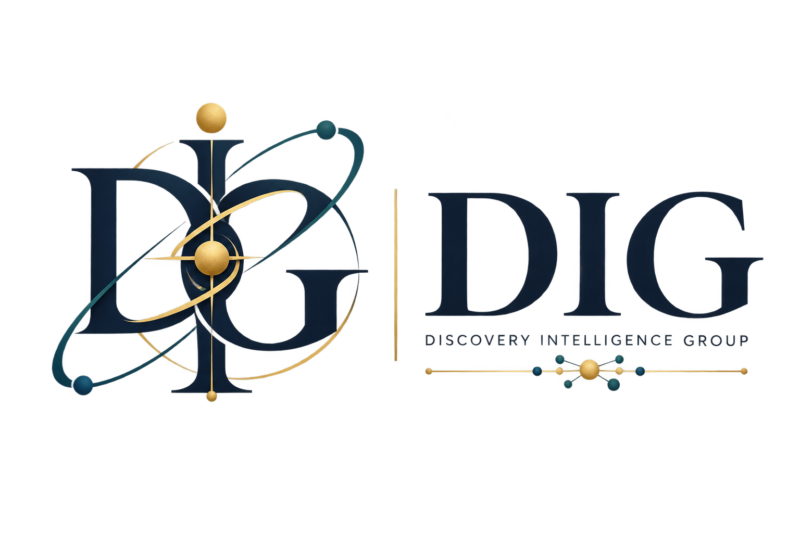

  

<h1 align="center">DIG — Discovery Intelligence Group</h1>

<strong>Founded by Ling Yang · Peking University</strong>

  <a href="https://gen-verse.github.io/DIG/">Website</a> ·
  <a href="https://github.com/Gen-Verse">Gen-Verse</a> ·
  <a href="https://huggingface.co/Gen-Verse">Hugging Face</a> ·
  <a href="mailto:yangling0818@163.com">Contact</a>

**Ling Yang (杨灵)** is an **Assistant Professor (PI) at Peking University** and the **Founder of DIG**.

DIG focuses on four research directions:

- **LLM / Agent Post-Training**
- **RL Systems / Infrastructure**
- **Recursive Self-Improvement (RSI)**
- **AI for Discovery**

## Open Research

DIG develops open research systems with **[Gen-Verse](https://github.com/Gen-Verse)**, including ReasonFlux, RLAnything, OpenClaw-RL, GenEnv, MMaDA, dLLM-RL, LatentMAS, and more.

## Join Us

We welcome **Master's students, PhD students, postdocs, and research interns**, and are open to academic and industrial collaborations.

**Contact:** [yangling0818@163.com](mailto:yangling0818@163.com)

---

### 中文

**杨灵，北京大学助理教授（PI），Discovery Intelligence Group（DIG，发现智能课题组）创始人。**

DIG 主要研究方向包括 **LLM / Agent Post-Training、强化学习系统与基础设施、Recursive Self-Improvement (RSI)、AI for Discovery**。

长期招收硕士生、博士生、博士后和研究实习生，并欢迎学术界与产业界开展科研合作。
